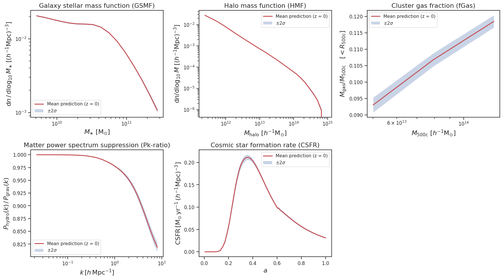
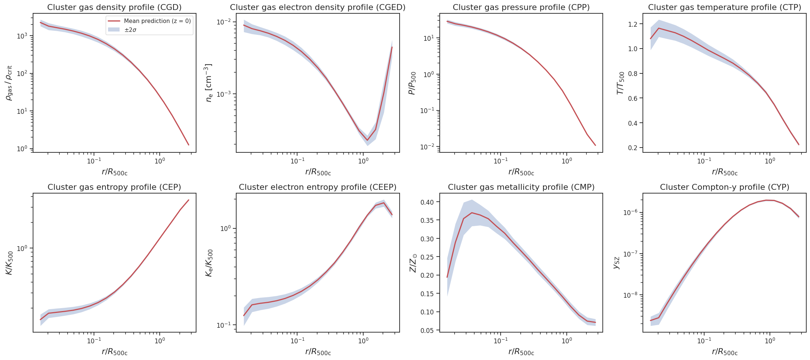
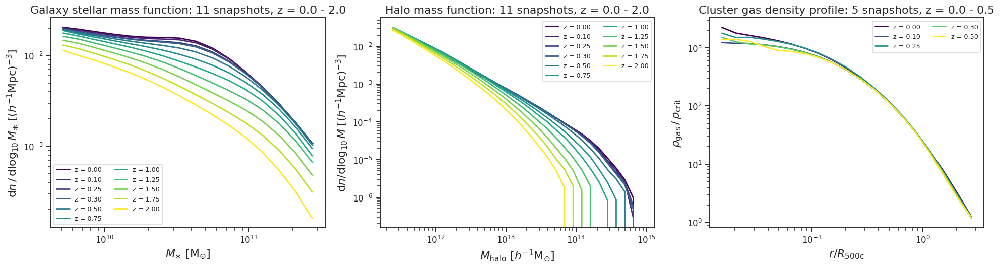
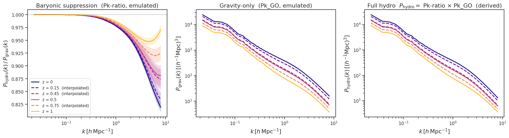

# Emulator suite for summary statistics from the simulations with varying subgrid and cosmological physics.

A Python package for fast, multi-redshift emulation of astrophysical and cosmological summary statistics trained on the CRK-HACC **CosmoHydro** simulation ensemble, which varies **5 subgrid-physics parameters and 2 cosmological parameters** simultaneously.

## Overview

This package provides trained Gaussian-Process surrogates that predict summary statistics as a function of subgrid physics *and* cosmology, at any redshift inside the trained range. The emulators were trained on 100 of the 110 hydrodynamical simulations of the CosmoHydro suite ($L = 400\,h^{-1}\mathrm{Mpc}$, $2\times1024^3$ particles), with the remaining 10 held out for validation. Each statistic is emulated independently using GP at every stored snapshot; predictions at intermediate redshifts are linearly interpolated between the two bracketing snapshot emulators.

Compared to [`subgrid_emu`](https://github.com/nesar/subgrid_emu) (5 subgrid parameters, $z=0$ only, smaller boxes) this suite adds cosmology as an input, a much larger simulation volume, more statistics (halo mass function, eight cluster profiles) and redshift evolution.

## Available Summary Statistics

### Summary statistics (5 subgrid + 2 cosmology parameters)

| Stat Name | Symbol | Description | Redshifts |
|-----------|--------|-------------|-----------|
| GSMF | $\mathrm{d}n / \mathrm{d}\log_{10} M_{\ast} \; [(h^{-1}\mathrm{Mpc})^{-3}]$ | Galaxy stellar mass function | 11 snapshots, $z = 0 - 2$ |
| HMF | $\mathrm{d}n / \mathrm{d}\log_{10} M \; [(h^{-1}\mathrm{Mpc})^{-3}]$ | Halo mass function | 11 snapshots, $z = 0 - 2$ |
| fGas | $M_{\mathrm{gas}} / M_{\mathrm{500c}} \quad [<R_{\mathrm{500c}}]$ | Cluster gas fraction | 7 snapshots, $z = 0 - 1$ |
| Pk-ratio | $P_{\mathrm{hydro}}(k) / P_{\mathrm{grav}}(k)$ | Matter power spectrum suppression | $z = 0, 0.1, 0.5, 1, 2$ |
| CSFR | $\mathrm{CSFR} \; [\mathrm{M}_{\odot}\,\mathrm{yr}^{-1}\,(h^{-1}\mathrm{Mpc})^{-3}]$ | Cosmic star formation history vs. scale factor $a$ | $z = 0$ output (full history) |

### Cluster profiles (5 subgrid + 2 cosmology parameters, $z = 0 - 0.5$, 5 snapshots)

Stacked radial profiles as a function of $r / R_{500c}$:

| Stat Name | Symbol | Description |
|-----------|--------|-------------|
| CGD | $\rho_{\mathrm{gas}} / \rho_{\mathrm{crit}}$ | Cluster gas density |
| CGED | $n_{\mathrm{e}} \; [\mathrm{cm}^{-3}]$ | Cluster gas electron density |
| CPP | $P / P_{500}$ | Cluster gas pressure |
| CTP | $T / T_{500}$ | Cluster gas temperature |
| CEP | $K / K_{500}$ | Cluster gas entropy |
| CEEP | $K_{\mathrm{e}} / K_{500}$ | Cluster electron entropy |
| CMP | $Z / Z_{\odot}$ | Cluster gas metallicity |
| CYP | $y_{\mathrm{SZ}}$ | Cluster Compton-$y$ (tSZ) |

### Gravity-only statistics (2 cosmology parameters)

| Stat Name | Symbol | Description | Redshifts |
|-----------|--------|-------------|-----------|
| Pk_GO | $P_{\mathrm{grav}}(k) \; [(h^{-1}\mathrm{Mpc})^3]$ | Gravity-only matter power spectrum | $z = 0, 0.1, 0.5, 1, 2$ |

The exact snapshot redshifts of any statistic are available via `get_redshifts(stat_name)` or `emu.redshifts`.

## Input Parameters

| # | Parameter | Symbol (and Scaling) | Range | Description |
|---|-----------|----------------------|-------|-------------|
| 1 | kappa_w | $\kappa_\mathrm{w}$ | (2.0, 4.0) | AGN wind coupling |
| 2 | e_w | $e_\mathrm{w}$ | (0.2, 1.0) | AGN energy efficiency |
| 3 | M_seed | $M_\mathrm{seed}/10^{6}$ | (0.6, 2.0) | Black hole seed mass (in $10^6\,M_\odot$) |
| 4 | v_kin | $v_\mathrm{kin}/10^{4}$ | (0.1, 1.2) | Kinetic feedback velocity (in $10^4$ km/s) |
| 5 | epsilon_kin | $\epsilon_\mathrm{kin}/10^{1}$ | (0.02, 1.2) | Kinetic feedback efficiency (in $10^1$) |
| 6 | omega_m | $\omega_\mathrm{m} = \Omega_\mathrm{m} h^2$ | (0.12, 0.155) | Physical matter density |
| 7 | sigma_8 | $\sigma_8$ | (0.7, 0.9) | Amplitude of matter fluctuations |

**Notes**
- Parameters must be provided in the scaled units shown above, in this order. `Pk_GO` takes only `[omega_m, sigma_8]`.
- The project fiducial cosmology is $\omega_\mathrm{m} = 0.14176$, $\sigma_8 = 0.8102$ (`FIDUCIAL_COSMOLOGY`).
- Predictions outside the training box raise a `RuntimeWarning` (disable with `check_bounds=False`).

## Installation

```bash
git clone https://github.com/nesar/cosmohydro_emu.git
cd cosmohydro_emu
pip install -e .
```

The only non-standard dependency is [SEPIA](https://github.com/lanl/SEPIA) (installed automatically from GitHub). Matplotlib is optional (`pip install -e .[plotting]`).

## Quick Start

```python
from cosmohydro_emu import load_emulator, get_x_grid, FIDUCIAL_COSMOLOGY

# Load the Galaxy Stellar Mass Function emulator (all 11 snapshots, z = 0-2)
emu = load_emulator('GSMF')
print(emu.redshifts)   # trained snapshot redshifts

# [kappa_w, e_w, M_seed/1e6, v_kin/1e4, eps_kin/1e1, omega_m, sigma_8]
params = [3.0, 0.5, 1.0, 0.65, 0.5, 0.14176, 0.8102]

# Predict at z = 0.3 (interpolated between the z = 0.25 and z = 0.30 snapshots)
mean, std = emu.predict(params, z=0.3)

# x-axis values (stellar masses here)
x_grid, x_label = get_x_grid('GSMF')

import matplotlib.pyplot as plt
plt.plot(x_grid, mean, label='Prediction')
plt.fill_between(x_grid, mean - 2 * std, mean + 2 * std, alpha=0.3, label=r'$\pm 2\sigma$')
plt.xscale('log'); plt.yscale('log')
plt.xlabel(x_label); plt.ylabel('GSMF'); plt.legend()
plt.show()
```

## Examples

A complete walkthrough is in [`examples/basic_usage.ipynb`](examples/basic_usage.ipynb).

### All summary statistics at $z = 0$



### Cluster profiles at $z = 0$



### Redshift evolution

```python
emu = load_emulator('HMF')
for z in emu.redshifts:          # or any z in emu.z_range
    mean, std = emu.predict(params, z=z)
```



### Power spectra

The full-hydro matter power spectrum is not emulated directly; it is the product of the emulated suppression ratio and the gravity-only spectrum (as used in the CosmoHydro inference against KiDS-Legacy $P_m$):

```python
ratio, _ = load_emulator('Pk-ratio').predict(params, z=0.45)      # P_hydro / P_grav
p_grav, _ = load_emulator('Pk_GO').predict(params[5:], z=0.45)    # P_grav(k) in (Mpc/h)^3
p_hydro = ratio * p_grav
```




### Batch predictions

```python
import numpy as np
params_batch = np.random.uniform(
    low=[2.0, 0.2, 0.6, 0.1, 0.02, 0.12, 0.7],
    high=[4.0, 1.0, 2.0, 1.2, 1.2, 0.155, 0.9],
    size=(10, 7),
)
mean, std = emu.predict(params_batch, z=0.5)          # shape (n_x, 10)
mean, std = emu.predict(params_batch, z=np.linspace(0, 1, 10))   # one z per row
```

### List statistics and metadata

```python
from cosmohydro_emu import list_available_statistics, get_statistic_info, get_parameter_info

list_available_statistics()   # {'summary': [...], 'profile': [...], 'gravity_only': [...]}
get_statistic_info('CGD')     # title, category, n_params, redshifts, grid size
get_parameter_info()          # names, LaTeX names, ranges, descriptions, scalings, fiducial
```

## API Reference

### Main Functions

#### `load_emulator(stat_name, redshifts=None, exp_variance=None)`
Load the emulator for one summary statistic (all trained snapshots by default).

**Parameters:**
- `stat_name` (str): Name of the summary statistic
- `redshifts` (array-like, optional): Subset of trained snapshot redshifts to load
- `exp_variance` (float or int, optional): Override the PCA basis size. By default it is read from each trained model file, which keeps the reconstructed basis consistent with the stored GP samples.

**Returns:** `CosmoHydroEmulator`

#### `CosmoHydroEmulator.predict(params, z=0.0, check_bounds=True)`
Predict the statistic for given parameters at redshift `z`.

**Parameters:**
- `params` (array-like): `(n_params,)` for one prediction or `(n_pred, n_params)` for a batch
- `z` (float or array-like): Redshift, inside `emu.z_range`; a per-row array is accepted for batches
- `check_bounds` (bool): Warn if parameters lie outside the training design

**Returns:**
- `mean` (np.ndarray): Prediction in physical units on `emu.x_grid`; shape `(n_x,)` or `(n_x, n_pred)`
- `std` (np.ndarray): GP predictive standard deviation, same shape

**Attributes:** `stat_name`, `n_params`, `param_names`, `param_keys`, `redshifts`, `z_range`, `x_grid`, `n_pc`

#### `list_available_statistics()`
Dictionary of statistic names grouped by `'summary'`, `'profile'`, `'gravity_only'`.

### Utility Functions

#### `get_x_grid(stat_name)` → `(x_grid, x_label)`
Independent-variable grid the emulator is defined on.

#### `get_redshifts(stat_name)` → `np.ndarray`
Trained snapshot redshifts (ascending).

#### `get_plot_info(stat_name)` → `dict`
`'title'`, `'xlabel'`, `'ylabel'`, `'xscale'`, `'yscale'`.

#### `get_valid_range(stat_name)` → `(min, max)`
Recommended range of the independent variable.

#### `get_parameter_info(stat_name=None)` → `dict`
Parameter names, LaTeX names, ranges, descriptions, scalings and fiducial values (restricted to the parameters of `stat_name` if given).

#### `get_statistic_info(stat_name=None)` → `dict`
Summary of one or all statistics: title, category, number of parameters, redshifts, grid size.

## Output conventions

- `GSMF` and `HMF` are returned as $\mathrm{d}n/\mathrm{d}\log_{10}M$ in $(h^{-1}\mathrm{Mpc})^{-3}$; `Pk_GO` as $P(k)$ in $(h^{-1}\mathrm{Mpc})^3$. Internally these emulators work on transformed targets and the returned standard deviations are propagated with the delta method.
- `Pk-ratio` returns the ratio of the full-hydro to gravity-only total matter power spectrum on $k \in [2\pi/L, k_{\rm Nyquist}] = [0.016, 8.0]\,h\,\mathrm{Mpc}^{-1}$.
- `CSFR` returns the star-formation-rate density as a function of scale factor `a` (the x-grid) from a single $z=0$ output; redshift interpolation does not apply.

## Package layout

```
cosmohydro_emu/
├── cosmohydro_emu/
│   ├── emulator.py         # CosmoHydroEmulator, load_emulator, list_available_statistics
│   ├── data_utils.py       # get_x_grid, get_redshifts, get_plot_info, get_parameter_info, ...
│   ├── model_metadata.py   # registry of statistics, parameters, labels, output transforms
│   ├── plot_routines.py    # optional matplotlib helpers
│   ├── data/               # <STAT>_training_data.npz  (design, training targets, grid, redshifts)
│   └── models/<STAT>/      # multivariate_model_z_index<i>.pkl  (trained SEPIA models)
├── examples/basic_usage.ipynb
├── scripts/export_training_data.py   # regenerates data/ and models/ from the CosmoHydro project
├── tests/
└── docs/                   # GitHub Pages site
```

Training, inference/MCMC codes are not provided here; this package only deploys the trained emulators.
